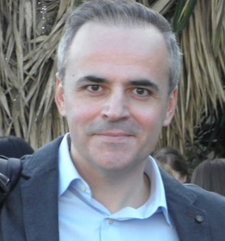

 

Nikos Doulaveras
============

Occupation: IT and Privacy Project Consultant 
-----------------------------------

-------------------     ----------------------------
1 Hippocratous Str.       nikos.doulaveras@gmail.com
Athens 11472        linkedin.com/in/nikosdoulaveras/ 
Greece                                +30 6947423178
Date of birth: 1977-11-7         Nationality: Greece 
-------------------     ----------------------------

 >  Seamless for IOT can be observable in terms of progress.  
 

# Experience
----------

**IT and Privacy Project Consultant:**
_  Master S.A. _
Master S.A. 
Neo Heracleion 
`2018-06 - Currently`

**Communication and Digital Marketing:**
* Freelancer 
Athens 
`2010-11 - 2018-05`

**Research Executive:**            
* MRB Hellas SA  
Ampelokipoi, Athens 
`2007-07 - 2010-10`

**Account Executive Advertising Projects:**                
* Spot JWT Athens  
Marousi- Athens 
`2004-05 - 2016-12`

            
# Education
----------
**Computer Science:**           
* Hellenic Open University  
Patras, `2017`

**Political Communication and New Technologies:**               
* Communication and Mass Media- MA- Postgraduate 
National and Kapoditristrian University of Athens/ MA Program 
Athens, `2003`

**Communication and Mass Media:**               
* Ptychion  
National and Kapodistrian University of Athens 
Athens, `2000`

# Skills
----------
       
• CMS development (Wordpress, Joomla)
            
• Arduino automation
            
• project management
            
• GDPR Certification DPO 

 
 # Languages
----------
        
• English, Advanced
            
• German, Advanced 

# Objectives 
----------
       
-Present proposals that are actionable
-Project management
-GDPR readiness
-Security as a priviledge
-HCI advancements  

|       Accomplishments      |       Hobbies        | 
|----------------------------|:--------------------:|
| ERMIS AWARDS 2004 HEINEKEN |       trekking       | 
|         EFFIE 2005         |       arduino        |
| 1rst Social Media Study IE |        guitar        |

* This is a test project
